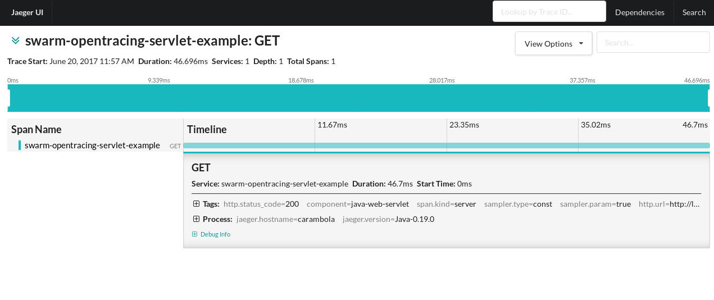

# OpenTracing Servlet example

This example is an extension of the Servlet example, adding OpenTracing
capabilities to it. Refer to the README on that example to understand
the basics of how it works.

> Please raise any issues found with this example in our JIRA:
> https://issues.jboss.org/browse/SWARM

## Project `pom.xml`

This project defines a dependency on the `org.wildfly.swarm:opentracing`
fraction, which brings the OpenTracing APIs with it.

By default, there's no concrete Tracer implementation available, so, spans
are collected as usual but the `NoopTracer` will just discard them. Your
application should provide a `Tracer` implementation that can be discovered
by the [`TracerResolver`](https://github.com/opentracing-contrib/java-tracerresolver).

The Servlet framework integration is part of the OpenTracing fraction and 
the filter is automatically registered. Any other framework integration 
(JAX-RS, CDI, ...) has to be provided by your application, or via other fractions.

## Running it with Jaeger

Like the Servlet example, you can run it many ways. It makes sense, however,
to add a concrete Tracer to the dependencies, in order to extract value from
this integration. 

The following is what would be required to do in order to see spans generated
by this example on Jaeger.

Make sure to at least export the environment variable `JAEGER_SERVICE_NAME`, 
otherwise Jaeger will complain. A good set for development and testing purposes
is the following:

```
export JAEGER_SERVICE_NAME=swarm-opentracing-servlet-example
export JAEGER_REPORTER_LOG_SPANS=true 
export JAEGER_SAMPLER_TYPE=const
export JAEGER_SAMPLER_PARAM=1 
```

Refer to the Jaeger documentation for further options.

Jaeger can be started via Docker as follows:

```
docker run \
    --rm \
    -p5775:5775/udp \
    -p6831:6831/udp \
    -p6832:6832/udp \
    -p5778:5778 \
    -p16686:16686 \
    -p14268:14268 \
    --name=jaeger \
    jaegertracing/all-in-one:latest
```

Jaeger will be available at [http://localhost:16686](http://localhost:16686)

And finally, before building the project, change the `pom.xml` to
uncomment the Jaeger dependencies.

You are now ready to run the example and have span data reported to Jaeger:

* mvn package && java -jar ./target/example-opentracing-servlet-swarm.jar
* mvn wildfly-swarm:run
* In your IDE run the `org.wildfly.swarm.Swarm` class

You may now make HTTP calls to the application, like:

```
curl http://localhost:8080/hello
```

On Jaeger, the Trace should look like this:


